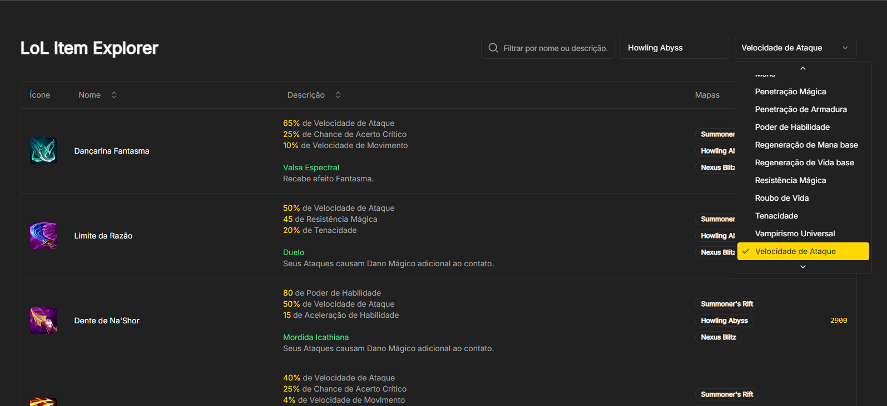

# LOL Item Explorer

Esta aplicação tem como objetivo, identificar, filtrar e ordenar os itens disponíveis no League of Legends.
\
\
Este aplicativo se torna interessante, principalmente para compor builds "off meta", pois por exemplo, ao tentar criar uma build "full atack speed", pode-se ordenar por velocidade de ataque, assim, retornando os itens com maior velocidade de ataque.
\

\
\
Também existe o caso de mapas especiais, como arena ou ARAM desordem, onde pode-se pesquisar por "chapéu", "cabeça"... retornando todos os itens beneficiados pelo aprimoramento "Chapéu de chapéu".
\

