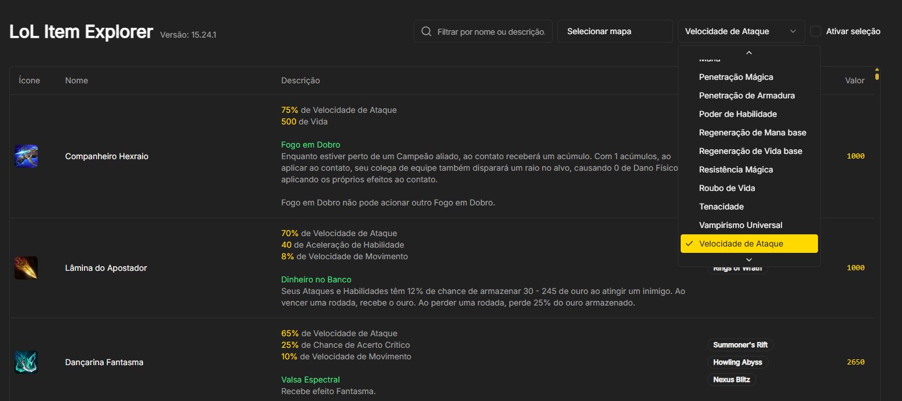
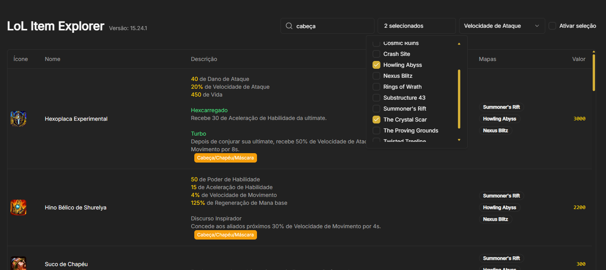
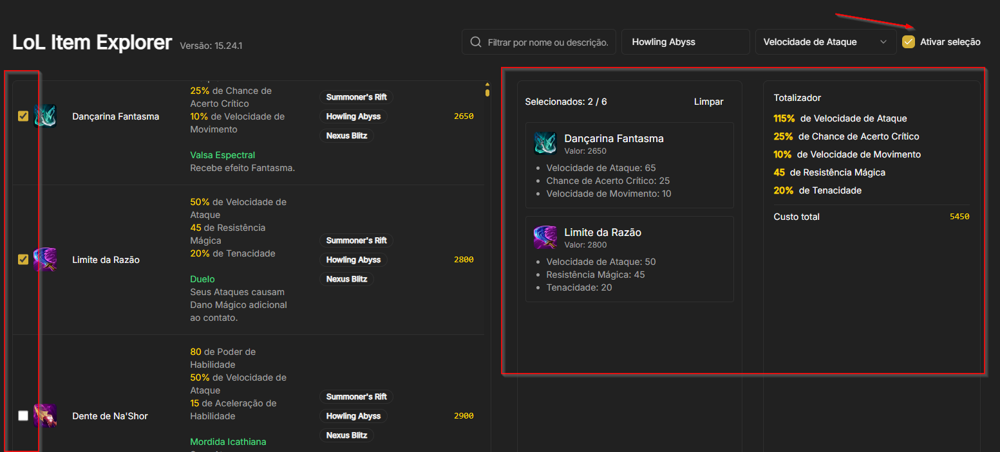

# LOL Item Explorer

## Esta aplicação tem como objetivo, identificar, filtrar e ordenar os itens disponíveis no League of Legends.
\
O aplicativo se torna interessante, principalmente para compor builds "off meta", pois por exemplo, ao tentar criar uma build "full atack speed", pode-se ordenar por velocidade de ataque, assim, retornando os itens com maior velocidade de ataque.
\

\
\
Também é possível filtrar por determinado mapa, pois alguns itens existem apenas em mapas específicos.
\

\
\
Para o caso de mapas especiais, como arena ou ARAM desordem, onde pode-se pesquisar por "chapéu", "cabeça"... retornando todos os itens beneficiados pelo aprimoramento "Chapéu de chapéu".
\

\
\
Foi adicionada uma funcionalidade para criação de builds, permitindo selecionar até 6 itens, totalizando os atributos e ouro.
\



## A aplicação foi desenvolvida com NextJS
\
Seguem of principais comandos a se utilizar para executar o serviço.

```
npm install
```
```
npm run build
```
```
npm run start
```
```
npm run dev
```

Ao executar o comando "npm run build", os pacotes serão gerados na pasta "out".
\
Basta adicionar a mesma no IIS.
